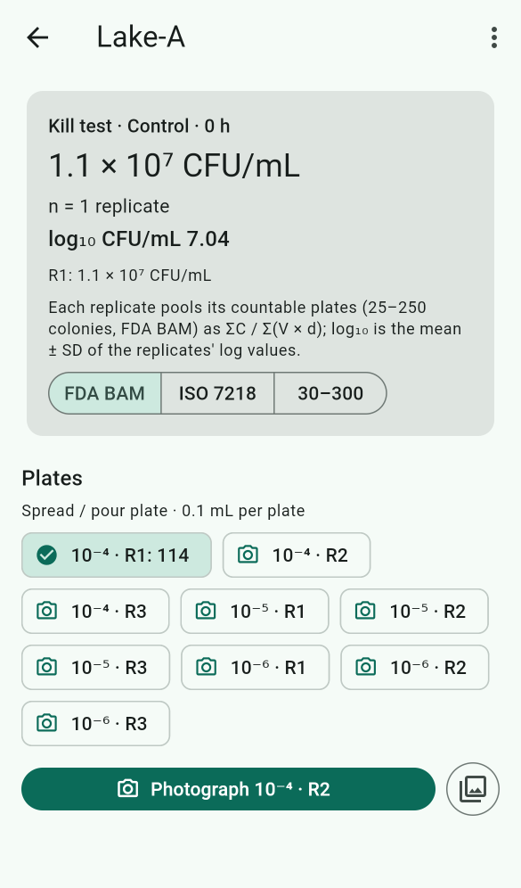
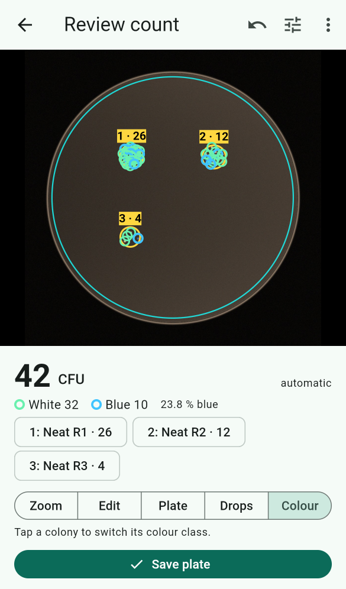
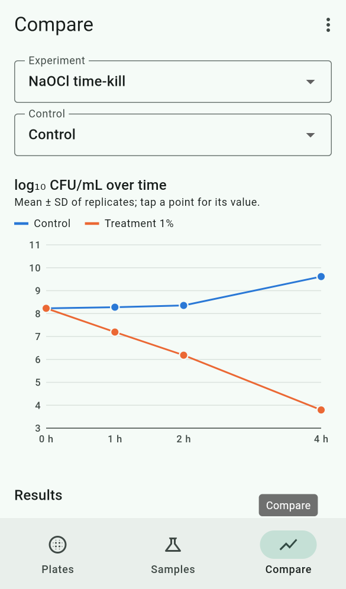

# Colony Counter app (Flutter, Android + iOS)

Photograph a 90 mm agar plate, get an automatic colony count, correct it by
tapping, and turn plate counts into CFU/mL. Everything runs on the phone, offline.

| Sample plan & replicates | Drop plate, blue/white | Time-kill comparison |
|---|---|---|
|  |  |  |

_Screenshots from the web build in Chromium on synthetic plates and demo data._

## Features (v0.5)
- **Thai and English** (`lib/l10n/`): every screen is in both languages. The app
  follows the phone's language, or choose it in Settings → *Language*. Thai text uses
  the bundled IBM Plex Sans Thai font, also on printed plate labels. CSV files,
  backups and the annotated photo banner stay in English.
- **Light and dark themes**: automatic (follows the phone), or fixed light or dark in
  Settings → *Appearance*.
- **CFU/g for solid samples** (food, soil): in sample setup choose *Solid (CFU/g)*
  and enter the sample weight and diluent volume (default 25 g in 225 mL). As usual,
  the initial suspension counts as the 10⁻¹ dilution, so plates are labelled with
  their total dilution. A suspension other than 1:10 (e.g. 10 g in 40 mL = 1:5) is
  corrected for automatically. Results, comparisons and the sample CSV use CFU/g.
- **Guided capture** (`ui/capture_screen.dart`, phones): circle guide for the dish and
  live checks for level, focus and glare; tap to focus, focus and exposure lock.
- **Automatic count** (`core/`): a pure-Dart port of the Python reference pipeline in
  `ml/`. Steps: find the plate, mask the rim, correct the background, threshold, split
  touching colonies, estimate clusters, flag spreaders and too-numerous plates. Each
  colony's colour is measured too.
- **Review and edit** (`ui/review_screen.dart`):
  - tap to remove or add a colony; long-press to set "×N" for clusters
  - undo, zoom, move or resize the plate circle, sensitivity slider and recount
- **Samples with dilution series and replicates** (`ui/samples_screen.dart`,
  `data/sample_info.dart`):
  - Set up a sample once: dilutions (e.g. 10⁻⁴ to 10⁻⁶), number of replicates,
    volume, and optionally experiment, condition and time point.
  - The app lists every plate in the plan and offers "Photograph 10⁻⁵ · R2" for the
    next one. Sample, dilution and replicate are filled in automatically.
  - The result is **mean ± SD, CV and log₁₀ CFU/mL ± SD** across replicates. Each
    replicate pools its countable plates as ΣC / Σ(V·d). Counting rules: FDA BAM
    25–250, ISO 7218 10–300, or 30–300.
  - "New sample like this" copies a plan, e.g. for the next time point.
- **Drop plates (Miles–Misra)**:
  - Drops are found automatically by grouping nearby colonies. Tap a drop to set its
    dilution, replicate or TNTC, tap empty agar to add one, and drag to move it.
  - Two layouts: one dilution per plate (drops are replicates), or all dilutions on
    one plate. Drops are counted with the 3–30 colony range and the drop volume.
- **Colony colours**: *Blue / white* (X-gal screening) or *Two colours* (chromogenic
  agar). Each colony's colour is classified automatically, the app shows counts per
  class and the percentage, and you tap a colony to switch its class.
- **Compare** (`ui/compare_screen.dart`): samples with the same *Experiment* name are
  tabulated by condition and time point as log₁₀ ± SD.
  - **log reduction ± SD** and **% kill** against a chosen control (at the same time
    point, or the control's only one).
  - A **time-kill / growth chart** with error bars when there are two or more time
    points.
- **Experiment details** (sample setup → *Experiment details*): strain, medium and
  batch, incubation time and temperature, operator and tags. The operator and medium
  are remembered for the next sample. The Samples tab has a search box that matches
  any of these, e.g. `pim pilot` or `NA-0923`.
- **QR plate labels** (`core/labels.dart`, `data/label_sheet.dart`):
  - Sample menu → *Print plate labels* makes an A4 PDF of 70 × 37 mm labels (3 × 8,
    24 per sheet), one per planned plate, with a QR code, the sample ID, dilution and
    replicate.
  - Scan a label (QR button on the Samples tab, or next to *Sample ID* when saving)
    to fill in the sample, dilution and replicate. Scanning a planned plate that
    has no photo yet offers to photograph it straight away.
- **Annotated photo** (`core/annotate.dart`): review screen menu → *Share annotated
  photo* makes a JPEG with the counted area, every colony mark (same colours as the
  app), drops with their counts, and a banner with sample, dilution, count and
  CFU/mL, for lab notebooks and reports.
- **Plate types** (`core/plate.dart`, `core/grid.dart`): 60, 90, 100 and 150 mm
  dishes, 100 and 120 mm square plates (found at any turn up to ±20°, with rounded
  corners left out), and 47 mm gridded **membrane filters**. The filter's printed
  grid is removed before counting, results are in **CFU/100 mL**, and the countable
  range is 20–80 or 20–200 per filter. Choose the type per sample, in the review
  menu, or as the default in Settings. The capture guide turns square for square
  plates.
- **Several plates in one photo** (`ui/multi_plate_screen.dart`, grid button on the
  Plates tab or *Photograph several plates at once* in a sample): every round plate
  is found and numbered in reading order. Each one is cut out and reviewed and
  saved like a single plate. From a sample, the plates fill its remaining dilutions
  and replicates in order. Missed or extra circles can be added or removed.
- **Time-lapse** (`core/timelapse.dart`, `ui/timelapse_screen.dart`): on a saved
  plate, *Add a later photo* takes another photo of the same plate (sample,
  dilution and plate type are copied; enter the hours since plating). The
  time-lapse view shows the count over time, when each colony first appeared
  (colonies are matched between photos, allowing for the plate being turned or
  flipped), and diameter growth in mm/h, with a CSV per colony. Only the latest
  photo counts towards CFU/mL.
- **Check-this-count warnings** (`core/pipeline.dart`): the app flags plates where
  its count is often wrong: crowded (over 3.5 colonies/cm²), many touching
  colonies (over 15 % of the count in estimated clusters) or faint colonies (over
  35 % barely above the threshold). A banner asks you to check before saving, and
  the plate list marks flagged plates that were saved without a check.
- **Counting accuracy** (`data/accuracy.dart`, `ui/accuracy_screen.dart`, menu →
  *Counting accuracy*): every 10th plate (adjustable, or never) the app asks you to
  check every colony and saves it as a reference count. The accuracy screen shows,
  on your own plates, the share within ±10 %, mean error and bias, the share of
  marks that were real and of colonies found, a chart of automatic vs checked
  counts, and errors by count range and by warning. You can also tick *Checked
  every colony* on any plate.
- **Training data from your corrections** (`data/training_export.dart`, menu →
  *Export training data*): a zip with the photos, COCO-style `annotations.json`
  (kept and added marks, cluster sizes, and the automatic marks you removed as
  negative examples) and YOLO labels. `ml/colonycounter/app_export.py` reads it.
- **Export and backup**:
  - *Export CSV* shares three files: one row per plate (including drops, colour
    classes and median colony diameter), one row per sample with mean, SD, CV, log₁₀
    and the experiment details, and one row per colony (position in mm from the
    plate centre, diameter in mm, colour class and Lab colour, drop).
  - *Back up all data* makes one zip with every plate, plan, photo and all three CSVs.
  - *Restore from backup* merges a zip back in; plates already present are kept.
    Use this to move data between phones and browsers, or to protect the web
    version's data.

## Layout
```
lib/
  core/   gray_image, plate (round/square finders, several plates), normalize,
          grid (membrane grid removal), classical, pipeline   ← counting (pure Dart)
          colour (Lab, blue/white), spots (drop plates), timelapse (tracking)
          annotate (marked-up photo), labels (QR payload, read from photo)
          calculator, stats (replicates, log reduction), capture_quality
  l10n/   app_en.arb, app_th.arb (generated from parts/*.json by
          tool/merge_strings.py), labels (localized option names)
  data/   plate_record, sample_info (plans, slots, details), plate_store,
          export (CSV, backup), label_sheet (PDF labels), accuracy,
          training_export, timelapse_data
          storage/ (files on phones, IndexedDB on web)
  ui/     home (tabs), capture, photo_flow, review, save sheet,
          samples, sample_setup, compare (table + chart), accuracy,
          multi_plate, timelapse
test/
  core_test.dart     golden plates: accuracy vs truth and vs the Python pipeline
  widget_test.dart   count → tap-edit → undo → save, end to end
  drop_plate_test.dart  drop plate from a plan: drops, dilutions, blue/white, CFU/mL
  ui_flows_test.dart    sample setup, replicate stats + next plate, log reduction
  features_test.dart    replicate stats, colour classes, drop-spot detection
  data_test.dart        CSVs, plan slots, backup → restore round trip
  records_test.dart     QR labels (encode, read from a photo, PDF sheet), details
                        and search, per-colony CSV, annotated photo
  formats_test.dart     60 mm, square and membrane plates; several plates per photo
  timelapse_test.dart   colony tracking across turned and mirrored photos
  trust_test.dart       accuracy stats, warnings, membrane units, training export,
                        time-lapse pooling; accuracy, time-lapse, multi-plate screens
  synth.dart            synthetic plate photos for the tests above
  cfug_test.dart        CFU/g for solid samples
  l10n_test.dart        every string translated; Thai and dark theme render
  capture_quality_test.dart
  fixtures/          synthetic plates + labels (ml/scripts/make_app_fixtures.py)
tool/compare.dart    prints Dart vs Python vs true counts
```

## Run it
```
flutter pub get
flutter test             # all tests
python tool/check_font_coverage.py   # every character in lib/ is in the bundled fonts
```
To add or change text: edit `lib/l10n/parts/*.json` (English and Thai side by side),
then run
```
python tool/merge_strings.py && flutter gen-l10n
flutter run              # on a connected phone
dart run tool/compare.dart
```
CI (`.github/workflows/app.yml`) runs analyze and tests, then builds a release APK
(downloadable as a workflow artifact) and an unsigned iOS build.

**APK signing:** every APK is signed with the same release key, so a new APK installs
over the previous one. The key is kept out of the repository, in three repository
secrets: `ANDROID_KEYSTORE_BASE64` (the .jks file, base64), `ANDROID_KEYSTORE_PASSWORD`
and `ANDROID_KEY_ALIAS`. CI writes them to `android/key.properties`; the android job
prints the certificate's SHA-256 so you can check it never changes. For a local signed
build, create `android/key.properties` with `storeFile`, `storePassword`, `keyAlias`,
`keyPassword` (both files are git-ignored). Without it, release builds use the debug
key. Keep a backup of the keystore: if it is lost, installed apps cannot be updated.

To regenerate the golden fixtures after changing the Python pipeline, run
`python ml/scripts/make_app_fixtures.py` from the repo root. The Dart count must stay
within ±5 % of Python's.

## Web version (iPhone without the App Store)
The same app also builds as a web app that runs in Safari on iPhone, or in any
modern browser:
```
app/tool/package_web.sh        # → dist/colony-counter-web.zip (about 6 MB)
```
**Hosting:** unzip into any folder on a static web host. No server code and no
rewrite rules are needed, and the app works from a subfolder. Requirements:
- **HTTPS.** The browser only allows the camera on secure pages (`localhost` is
  fine for testing).
- `.wasm` files should be served as `application/wasm` (most hosts already do; on
  Apache add `AddType application/wasm .wasm`).
- Fonts and the rendering engine are bundled; nothing loads from Google or any
  CDN.

**On the iPhone:** open the URL in Safari, then Share → *Add to Home Screen* so it
opens full screen like an app.
- **Camera:** "Count plate" opens the iPhone's own camera. The in-app guide circle and
  live level/focus/glare checks are phone-app only.
- **Counting:** runs in the browser on the phone. Nothing is uploaded. Photos are
  scaled to 3000 px on the long side first.
- **Storage:** plates are saved in the browser's IndexedDB. Safari may clear a site's
  data if it is unused for about 7 days unless it was added to the Home Screen, so
  export the CSV regularly.
- **Speed:** counting runs on the page's main thread (browsers have no isolates), so
  the screen pauses for a few seconds while counting.


- **Not yet tried on a physical phone.** The build environment had no Android SDK or
  Xcode. Check the camera flow, the live checks and timing on real devices first.
- Square plates, membrane filters, several plates per photo and time-lapse
  tracking have only been tested on synthetic photos. Real gridded filters (lines
  of other colours or widths) and colonies touching the grid need checking. The
  lightbox in `hardware/` fits 90 mm dishes only.
- Photos are analysed with their short side scaled to 1800 px (about 65 µm/px for a
  dish filling 80 % of the frame). Colonies under about 0.2 mm may be missed until
  tiled full-resolution detection is added together with the trained model.
- The classical detector is the baseline. A trained detector (LiteRT / Core ML) will
  plug in behind `countColonies`, and the review screen stays the same.
