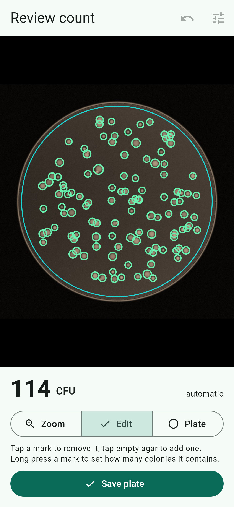
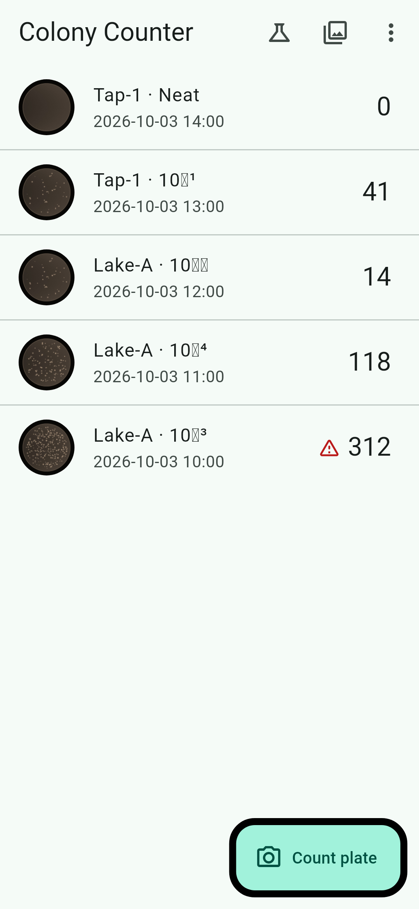
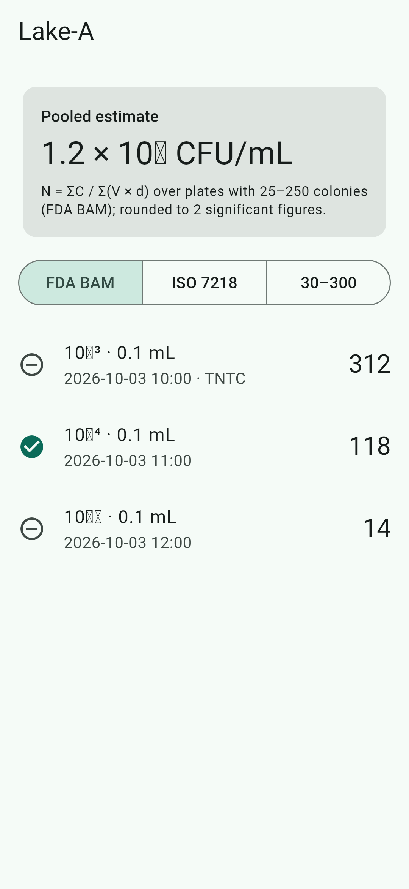

# Colony Counter app (Flutter, Android + iOS)

Photograph a 90 mm agar plate, get an automatic colony count, correct it by
tapping, and turn plate counts into CFU/mL. Everything runs on the phone, offline.

| Review a count | History | Pooled CFU/mL for a sample |
|---|---|---|
|  |  |  |

_Screenshots are rendered by the test harness on a synthetic plate. Shadows draw as
black rings there, and some superscripts show as boxes because only Roboto is loaded.
Phones use their system fonts._

## Features (v0.1)
- **Guided capture** (`ui/capture_screen.dart`): circle guide for the dish and live
  checks for level (motion sensor), focus (sharpness relative to the recent best)
  and glare (clipped pixels). Also: tap to focus, focus and exposure lock, flash off.
- **Automatic count** (`core/`): a pure-Dart port of the Python reference pipeline in
  `ml/`. Steps: find the plate, mask the rim, correct the background, threshold,
  split touching colonies, estimate clusters, flag spreaders and too-numerous plates.
  Runs on a background isolate.
- **Review and edit** (`ui/review_screen.dart`):
  - tap a mark to remove it; tap empty agar to add one
  - long-press a mark to set "×N" for clusters
  - undo, pinch-zoom, move or resize the plate circle, sensitivity slider and recount
- **CFU/mL** (`core/calculator.dart`): per plate and pooled per sample ID, using
  ΣC / Σ(V·d). Counting rules: FDA BAM 25–250, ISO 7218 10–300, or 30–300. Results
  are marked estimated, "<" or ">" when no plate is in range.
- **History and export**: plates are saved on the phone (JSON plus the photo); swipe
  to delete; export everything as a CSV via the share sheet.

## Layout
```
lib/
  core/   gray_image, plate, normalize, classical, pipeline   ← counting (pure Dart)
          calculator, capture_quality                         ← CFU maths, live checks
  data/   plate_record (model + CSV), plate_store (JSON on disk)
  ui/     home, capture, review, save sheet, samples
test/
  core_test.dart     golden plates: accuracy vs truth and vs the Python pipeline
  widget_test.dart   count → tap-edit → undo → save, end to end
  data_test.dart, capture_quality_test.dart
  fixtures/          synthetic plates + labels from ml/colonycounter/synth.py
tool/compare.dart    prints Dart vs Python vs true counts
```

## Run it
```
flutter pub get
flutter test             # 24 tests
flutter run              # on a connected phone
dart run tool/compare.dart
```
CI (`.github/workflows/app.yml`) runs analyze and tests, then builds a release APK
(downloadable as a workflow artifact) and an unsigned iOS build.

To regenerate the golden fixtures after changing the Python pipeline, run
`python ml/scripts/make_app_fixtures.py` from the repo root. The Dart count must stay
within ±5 % of Python's.

## Web version (iPhone without the App Store)
The same app also builds as a web app that runs in Safari on iPhone, or in any
modern browser:
```
app/tool/package_web.sh        # → dist/colony-counter-web.zip (about 6 MB)
```
**Hosting:** unzip into any folder on a static web host. No server code and no
rewrite rules are needed, and the app works from a subfolder. Requirements:
- **HTTPS.** The browser only allows the camera on secure pages (`localhost` is
  fine for testing).
- `.wasm` files should be served as `application/wasm` (most hosts already do; on
  Apache add `AddType application/wasm .wasm`).
- Fonts and the rendering engine are bundled; nothing loads from Google or any
  CDN.

**On the iPhone:** open the URL in Safari, then Share → *Add to Home Screen* so it
opens full screen like an app.
- **Camera:** "Count plate" opens the iPhone's own camera. The in-app guide circle and
  live level/focus/glare checks are phone-app only.
- **Counting:** runs in the browser on the phone. Nothing is uploaded. Photos are
  scaled to 3000 px on the long side first.
- **Storage:** plates are saved in the browser's IndexedDB. Safari may clear a site's
  data if it is unused for about 7 days unless it was added to the Home Screen, so
  export the CSV regularly.
- **Speed:** counting runs on the page's main thread (browsers have no isolates), so
  the screen pauses for a few seconds while counting.


- **Not yet tried on a physical phone.** The build environment had no Android SDK or
  Xcode. Check the camera flow, the live checks and timing on real devices first.
- Photos are analysed with their short side scaled to 1800 px (about 65 µm/px for a
  dish filling 80 % of the frame). Colonies under about 0.2 mm may be missed until
  tiled full-resolution detection is added together with the trained model.
- The classical detector is the baseline. A trained detector (LiteRT / Core ML) will
  plug in behind `countColonies`, and the review screen stays the same.
